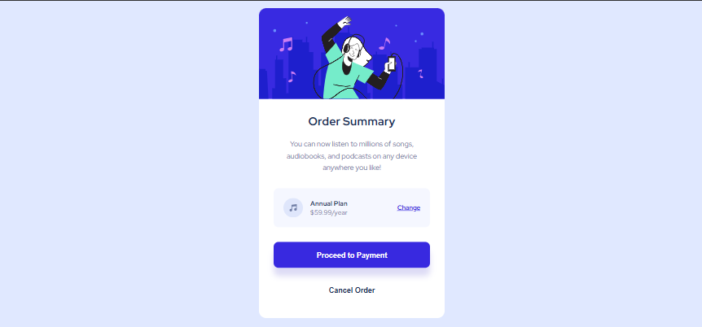

# Order Summary Component

This is a solution to the Order Summary Component challenge on Frontend Mentor.  
Frontend Mentor challenges help you improve your coding skills by building realistic projects.

---

## 📸 Screenshot

---

## 🔗 Links

- Solution URL: [Add your solution link here]
- Live Site URL: [Add your live site link here]

---

## 🛠️ Built with

- Semantic HTML5
- CSS custom properties
- Flexbox
- Mobile-first workflow
- Media queries for responsive design

---

## 📚 What I learned

This project helped me practice:
- Structuring components using semantic HTML
- Handling SVG images correctly
- Switching background images for mobile and desktop using media queries
- Improving spacing and layout for desktop screens

---

## 🚀 Continued development

I plan to continue improving my responsive design skills and work on more Frontend Mentor challenges to refine my CSS layout and spacing techniques.

---

## 👤 Author

- Frontend Mentor – [@yourusername](https://www.frontendmentor.io/profile/yourusername)

---

## 🙏 Acknowledgments

Thanks to Frontend Mentor for providing this challenge and design resources.